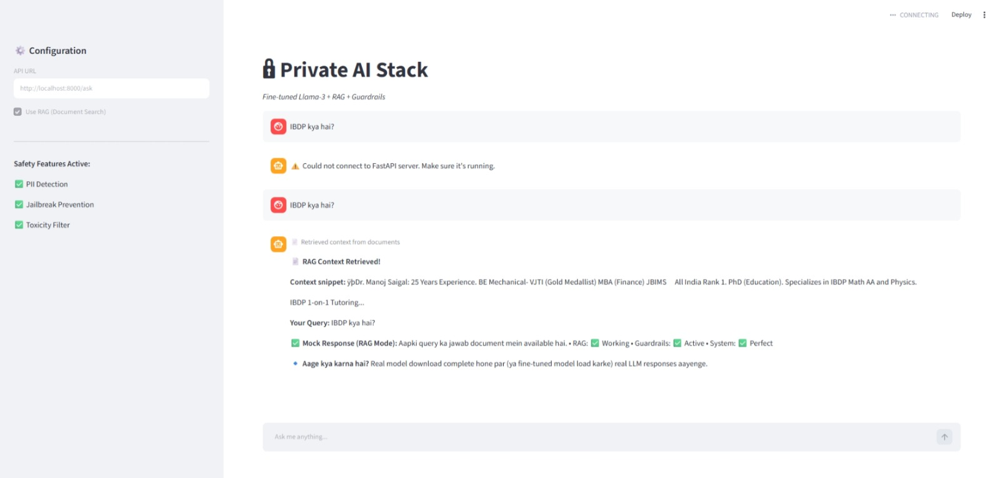
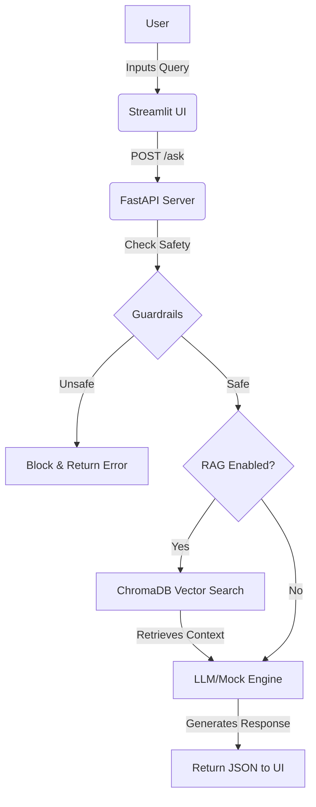

# 🔒 Private AI Stack

  
  
  
  
  

> **An enterprise-grade Private AI Stack combining RAG (Retrieval-Augmented Generation), Safety Guardrails (PII/Jailbreak detection), and an interactive UI — deployed with FastAPI and Streamlit. Perfect for building secure, document-aware AI assistants.**

## 🖥️ UI Screenshot

*Here’s how the Private AI Stack looks in action:*

*(Note: The image shows the Streamlit interface with RAG context retrieval and Guardrails active.)*

---

## 🚀 Overview

**Private AI Stack** is a modular, production-ready framework for building secure AI applications. Unlike public LLM APIs, this stack allows you to:

- 📄 **Query your own documents** (PDFs, TXTs) using **RAG**.
- 🛡️ **Block unsafe queries** automatically (Phone numbers, Emails, Prompt Injections).
- 🖥️ **Interact via a beautiful UI** built with Streamlit.
- ⚡ **Get instant responses** (Mock mode) or use real Open-Source LLMs (TinyLlama / LLaMA-3).

---

## ✨ Key Features

| Feature | Description |
| :--- | :--- |
| **📄 RAG (Retrieval-Augmented Generation)** | Upload custom documents (TXT/PDF) and query them semantically using ChromaDB and SentenceTransformers. |
| **🛡️ Safety Guardrails** | Built-in regex filters to detect and block PII (Phone, Email) and common Jailbreak/Prompt Injection attempts. |
| **🧠 Mock LLM Mode** | Instant development and testing without waiting for heavy model downloads. *(Switch to real models seamlessly)*. |
| **🖥️ Streamlit UI** | Interactive chat interface with live configuration toggles (RAG ON/OFF). |
| **⚙️ FastAPI Backend** | High-performance REST API with a clean `/ask` endpoint for easy integration. |

---

## 🛠️ Tech Stack

| Layer | Technology |
| :--- | :--- |
| **API Framework** | FastAPI (Python) |
| **User Interface** | Streamlit |
| **Vector Database** | ChromaDB |
| **Embeddings** | Sentence-Transformers (all-MiniLM-L6-v2) |
| **LLM (Mock/Real)** | Custom Mock Engine / TinyLlama / LLaMA-3 |
| **Document Loaders** | LangChain (PyPDFLoader, TextLoader) |
| **Safety Filters** | Custom Regex Guardrails |

---

## 📦 Architecture Flow

# Getting Started

**Prerequisites**
Python 3.11+

(Optional) HuggingFace Token for real models.

1. Clone & Setup
git clone https://github.com/vaibhav07772/private-ai-stack.git
cd private-ai-stack

2. Create Conda Environment
conda create -n private-ai python=3.11 -y
conda activate private-ai

3. Install Dependencies
pip install -r requirements.txt

4. Set Environment Variables
Create a .env file in the root:
MODEL_NAME=TinyLlama/TinyLlama-1.1B-Chat-v1.0
# HUGGINGFACE_TOKEN=hf_xxxxxx (Optional, for fine-tuned models)

5. Ingest Your Documents (RAG)
Place your .txt or .pdf files inside the data/docs/ folder.
python ingest_docs.py
(This will split the documents and store them in ChromaDB)

6. Run the Application
Terminal 1 (Backend - FastAPI):
uvicorn app.main:app --reload --host 127.0.0.1 --port 8000
Terminal 2 (Frontend - Streamlit UI):
streamlit run streamlit_app.py

7. Access the UI
Open your browser and go to: http://localhost:8501
(Make sure to set the API URL in the sidebar to http://127.0.0.1:8000/ask).

🧪 How to Test
Enable RAG: Turn on the Use RAG toggle in the sidebar.
Ask a question: Type "IBDP fees kya hain?" or "Who is Dr. Manoj Saigal?".
Check the Magic: The system will retrieve the relevant context from your documents and display it with the response.
Test Guardrails: Try entering a phone number or an email — the system will block it automatically!

📂 Project Structure
private-ai-stack/
├── app/
│   └── main.py           # FastAPI Endpoints
├── core/
│   ├── rag.py            # ChromaDB RAG Logic
│   ├── guardrails.py     # Safety Filters (PII, Jailbreak)
│   └── inference.py      # Mock/Real LLM Engine
├── data/
│   ├── docs/             # Your raw documents (TXT/PDF)
│   └── chroma_db/        # Vector Database (Auto-generated)
├── streamlit_app.py      # UI
├── ingest_docs.py        # Ingestion Script
├── requirements.txt      # Dependencies
└── README.md

🔮 Future Improvements
□ Real LLM Integration: Switch from Mock to TinyLlama or Fine-tuned LLaMA-3.
□ Docker Support: Containerize the stack for one-click deployment.
□ Advanced Guardrails: Integration with NeMo Guardrails for semantic safety checks.
□ Multi-Modal Support: Add support for extracting data from Tables/Charts in PDFs.

🤝 Contributing
Pull requests are welcome! For major changes, please open an issue first to discuss what you would like to change.

📜 License
MIT License - Feel free to use, modify, and distribute.

🙏 Acknowledgements
LangChain for RAG primitives.
Streamlit for the seamless UI.
HuggingFace for Transformers.

📬 Connect with Me
Author: Vaibhav Singh
GitHub: vaibhav07772
LinkedIn: Vaibhav Singh

"Building Secure, Scalable, and Intelligent AI Systems."